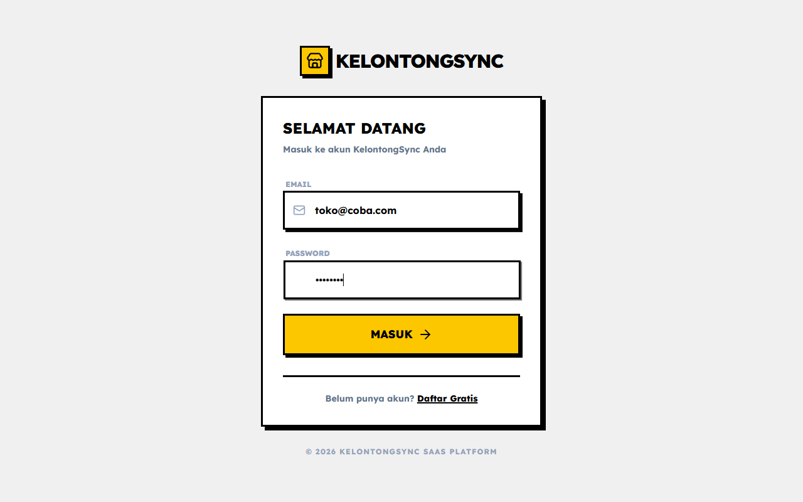
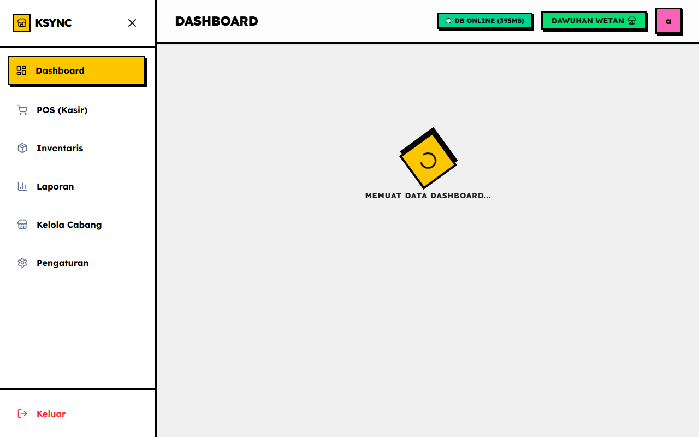

# 🛒 KelontongSync

> **SaaS Manajemen Toko Kelontong Modern — Cepat, Pintar, dan Skalabel**


---

## 🚀 Live Demo & Akses Aplikasi

Anda dapat langsung mencoba aplikasi KelontongSync yang telah di-deploy ke Vercel:

👉 **[Buka Aplikasi KelontongSync](https://kelontong-sync.vercel.app/)**

**Gunakan Kredensial Login Demo berikut untuk mencoba aplikasi:**
- **Email:** `toko@coba.com`
- **Password:** `12345678`

---

## 📸 Tampilan Aplikasi & Panduan Singkat

### 1. Halaman Login
Silakan buka aplikasi dan login menggunakan kredensial di atas.


### 2. Dashboard Kasir
Setelah login, Anda akan melihat ringkasan omzet, transaksi, dan grafik interaktif penjualan.


> **💡 Panduan Lengkap:** Untuk detail penggunaan Kasir (POS) dan Inventaris, silakan baca **[Panduan Penggunaan Lengkap (User Guide)](./docs/user-guide.md)**.

---

## ✨ Fitur Utama

| Fitur | Deskripsi |
|-------|-----------|
| 🧾 **Kasir Cepat (POS)** | Transaksi dengan pencarian/scan barcode, manajemen keranjang belanja, kalkulasi kembalian otomatis, dan cetak struk PDF/thermal |
| 📦 **Manajemen Inventaris** | CRUD produk lengkap, manajemen kategori dengan emoji icon, alert stok menipis, dan import massal via CSV/Excel/JSON |
| 📊 **Dashboard Analitik** | Grafik tren penjualan interaktif, laporan harian/mingguan/bulanan/tahunan, pie chart kategori terpopuler, dan top produk terlaris |
| 🏪 **Multi-Cabang** | Kelola banyak toko dari satu akun, store switcher cepat, dan isolasi data penuh per cabang |
| 👥 **Manajemen User** | Sistem role bertingkat (superadmin/owner/kasir), manajemen staf, dan assign kasir ke cabang tertentu |

---

## 🛠️ Tech Stack

### Frontend
| Teknologi | Versi | Keterangan |
|-----------|-------|------------|
| Next.js | 16.2.6 | React framework dengan App Router & Server Actions |
| React | 19.2.4 | UI library |
| TypeScript | 5 | Type safety di seluruh codebase |

### Styling & Animasi
| Teknologi | Versi | Keterangan |
|-----------|-------|------------|
| Tailwind CSS | v4 | Utility-first CSS framework |
| Framer Motion | 12.38.0 | Animasi dan transisi UI yang halus |

### Backend & Database
| Teknologi | Keterangan |
|-----------|------------|
| Supabase | PostgreSQL database, Auth, dan Storage |
| Supabase Auth | Autentikasi email/password bawaan |
| Supabase Storage | Upload gambar produk |

### Libraries Pendukung
| Library | Keterangan |
|---------|------------|
| Recharts | Visualisasi grafik bar chart dan pie chart |
| jsPDF + jspdf-autotable | Generate laporan dan struk dalam format PDF |
| PapaParse | Parsing file CSV untuk import produk massal |
| xlsx | Parsing file Excel (.xlsx/.xls) untuk import produk |
| Lucide React | Koleksi ikon SVG yang konsisten |
| clsx + tailwind-merge | Utility untuk class merging kondisional |

### Tooling & Deployment
| Teknologi | Keterangan |
|-----------|------------|
| pnpm | Package manager yang cepat dan efisien |
| Vercel | Hosting dan CI/CD deployment |
| ESLint | Linting dan code quality |

---

## 📁 Struktur Folder

```
kelontong-sync/
├── src/
│   ├── app/
│   │   ├── page.tsx                  # Landing page (halaman marketing)
│   │   ├── layout.tsx                # Root layout
│   │   ├── not-found.tsx             # Halaman 404
│   │   ├── login/                    # Halaman login
│   │   ├── register/                 # Halaman registrasi multi-step
│   │   ├── dashboard/                # Modul utama aplikasi
│   │   │   ├── page.tsx              # Dashboard overview
│   │   │   ├── layout.tsx            # Layout sidebar dashboard
│   │   │   ├── actions.ts            # Server Actions Supabase
│   │   │   ├── pos/                  # Modul kasir POS
│   │   │   ├── inventory/            # Manajemen inventaris & produk
│   │   │   ├── reports/              # Laporan & analitik
│   │   │   ├── management/           # Manajemen multi-cabang
│   │   │   └── settings/             # Pengaturan toko & profil
│   │   ├── admin/                    # Portal superadmin
│   │   └── tenant/                   # Monitoring tenant SaaS
│   ├── components/
│   │   └── dashboard/               # Komponen UI reusable
│   └── lib/                         # Supabase client & helper functions
├── docs/                            # Dokumentasi proyek
│   ├── database.md                  # Skema SQL database lengkap
│   ├── rencana.md                   # Rencana pembangunan proyek
│   ├── checklist.md                 # Checklist progres tim
│   ├── user-guide.md                # Panduan pengguna
│   └── deployment.md                # Panduan deployment
├── scripts/                         # Skrip utilitas & seeder
│   ├── create-superadmin.js         # Buat akun superadmin
│   ├── seed-data.ts                 # Seeder 100 produk + 300 hari transaksi
│   ├── seed-tenant.js               # Seeder data tenant
│   └── diagnose-db.ts               # Diagnostik koneksi database
├── public/                          # Aset statis
├── contoh_import.csv                # Contoh file CSV untuk import produk
├── contoh_import.json               # Contoh file JSON untuk import produk
├── .env.example                     # Template environment variables
├── next.config.ts                   # Konfigurasi Next.js
├── tailwind.config.ts               # Konfigurasi Tailwind CSS
└── package.json
```

---

## 🚀 Quick Start

### Prerequisites

Pastikan semua tools berikut sudah terpasang di komputer Anda:

- **Node.js** >= 18.x → [nodejs.org](https://nodejs.org)
- **pnpm** >= 8.x → `npm install -g pnpm`
- Akun **Supabase** (gratis) → [supabase.com](https://supabase.com)
- Akun **Vercel** (gratis) → [vercel.com](https://vercel.com)

### Langkah Setup

**1. Clone repository**
```bash
git clone <repo-url>
cd kelontong-sync
```

**2. Install dependencies**
```bash
pnpm install
```

**3. Setup environment variables**

Salin file `.env.example` menjadi `.env.local` dan isi nilainya:
```bash
cp .env.example .env.local
```

Buka `.env.local` dan isi dengan kredensial Supabase Anda:
```env
NEXT_PUBLIC_SUPABASE_URL=https://xxxxx.supabase.co
NEXT_PUBLIC_SUPABASE_ANON_KEY=eyJ...
```

Nilai ini bisa ditemukan di Supabase Dashboard → **Settings → API**.

**4. Setup database Supabase**

Buka **SQL Editor** di dashboard Supabase Anda, salin seluruh SQL dari file [`docs/database.md`](./docs/database.md), lalu klik **Run**. Ini akan membuat semua tabel yang dibutuhkan.

Setelah itu, buat Storage Bucket bernama `product-images` di **Storage → New Bucket** dan set ke **Public**.

**5. Buat akun Superadmin**
```bash
node scripts/create-superadmin.js
```

**6. (Opsional) Isi data demo**

Untuk mengisi database dengan 100 produk nyata dan 300 hari riwayat transaksi:
```bash
npx tsx scripts/seed-data.ts
```

**7. Jalankan server development**
```bash
pnpm dev
```

Buka [http://localhost:3000](http://localhost:3000) di browser Anda.

---

## 🔐 Environment Variables

| Variable | Keterangan | Wajib |
|----------|------------|-------|
| `NEXT_PUBLIC_SUPABASE_URL` | URL project Supabase Anda (format: `https://xxxxx.supabase.co`) | ✅ Ya |
| `NEXT_PUBLIC_SUPABASE_ANON_KEY` | Anon/public key dari Supabase project Anda | ✅ Ya |

Kedua nilai ini bisa ditemukan di **Supabase Dashboard → Settings → API → Project URL & Project API Keys**.

---

## 👨‍💻 Tim Pengembang

Proyek ini dikerjakan oleh tim mahasiswa dalam mata kuliah **Pemrograman Perangkat Lunak (PPL)**.

| Nama | Peran | Tanggung Jawab |
|------|-------|----------------|
| **Abdur Rouf** | Project Manager & Full Backend Developer | Manajemen proyek, skema database Supabase, Server Actions, CI/CD Vercel |
| **Rafi** | Frontend Developer | Modul Kasir POS — antarmuka kasir, logika keranjang, cetak struk PDF/thermal |
| **Akmal** | Frontend Developer | Modul Inventaris — CRUD produk, kategori, alert stok, import CSV/Excel/JSON |
| **Adam** | Frontend Developer | Modul Dashboard & Laporan — grafik Recharts, filter periode, export PDF |
| **Ferdy** | Frontend Developer | Modul Multi-Cabang & Settings — store switcher, manajemen staf, pengaturan toko |

---

## 📚 Dokumentasi Lengkap

| Dokumen | Deskripsi |
|---------|-----------|
| [`docs/database.md`](./docs/database.md) | Skema SQL database lengkap dan diagram ERD |
| [`docs/user-guide.md`](./docs/user-guide.md) | Panduan penggunaan per halaman dan fitur |
| [`docs/deployment.md`](./docs/deployment.md) | Panduan deployment ke Supabase dan Vercel |
| [`docs/rencana.md`](./docs/rencana.md) | Rencana teknis dan arsitektur sistem |
| [`docs/checklist.md`](./docs/checklist.md) | Checklist progres pembangunan per fase |

---

## 📄 Lisensi

Proyek ini dilisensikan di bawah **MIT License**.

```
MIT License

Copyright (c) 2025 Tim KelontongSync

Permission is hereby granted, free of charge, to any person obtaining a copy
of this software and associated documentation files (the "Software"), to deal
in the Software without restriction, including without limitation the rights
to use, copy, modify, merge, publish, distribute, sublicense, and/or sell
copies of the Software, and to permit persons to whom the Software is
furnished to do so, subject to the following conditions:

The above copyright notice and this permission notice shall be included in all
copies or substantial portions of the Software.

THE SOFTWARE IS PROVIDED "AS IS", WITHOUT WARRANTY OF ANY KIND, EXPRESS OR
IMPLIED, INCLUDING BUT NOT LIMITED TO THE WARRANTIES OF MERCHANTABILITY,
FITNESS FOR A PARTICULAR PURPOSE AND NONINFRINGEMENT.
```

---

<div align="center">

Dibuat dengan ❤️ oleh Tim KelontongSync · Mata Kuliah PPL

</div>
