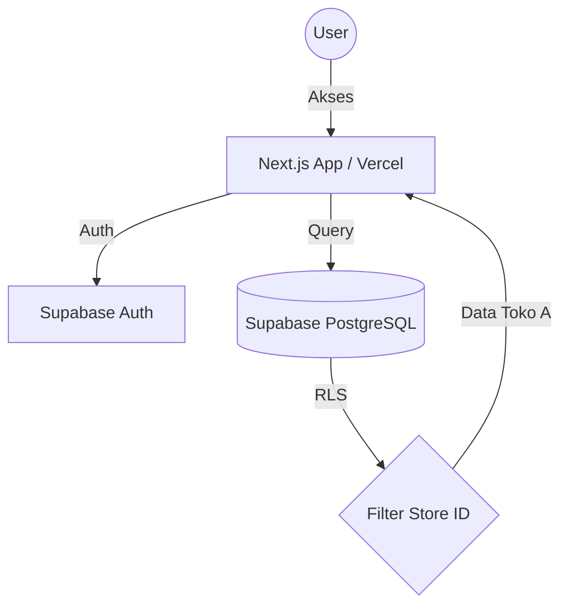
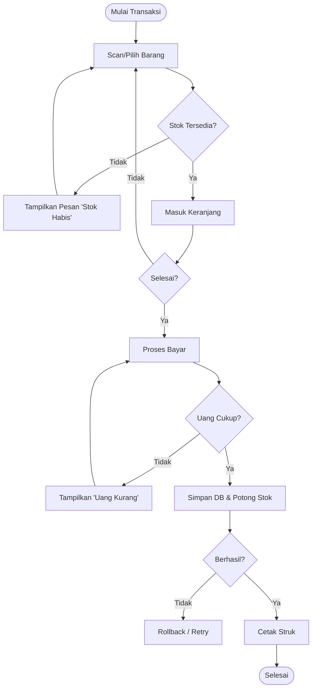

# Diagram & Logika Sistem KelontongSync

Dokumen ini menjelaskan alur kerja aplikasi, logika bisnis, serta strategi mitigasi kesalahan (error handling).

## 1. Arsitektur Sistem (High Level)
Aplikasi ini menggunakan pola **SaaS Multi-Tenant** sederhana berbasis branch/store ID.

## 2. Flowchart Transaksi POS & Penanganan Error
Alur ini mencakup logika pengecekan stok dan mitigasi kegagalan pembayaran.

## 3. Logika Multi-Cabang & Keamanan (RLS)
Setiap data (Barang, Transaksi, Karyawan) memiliki kolom `store_id`.
- **Logika**: Saat user login, sistem mengambil `store_id` dari profil user.
- **Mitigasi**: User tidak bisa melihat atau mengubah data milik `store_id` lain meskipun mereka tahu ID barangnya (menggunakan Supabase Row Level Security).

## 4. Tabel Mitigasi Error & Penanganan

| Kejadian (Error) | Dampak | Solusi / Mitigasi |
| :--- | :--- | :--- |
| **Koneksi Internet Putus** | Transaksi tidak tersimpan ke cloud. | Implementasi *Local State* sementara. Jika gagal simpan, beri peringatan "Offline" dan tombol "Coba Lagi". |
| **Stok Minus (Race Condition)** | Stok di DB tidak akurat. | Gunakan **Database Constraint** (CHECK stock >= 0) dan **SQL Trigger** untuk validasi di sisi server. |
| **Sesi Login Habis** | Gagal simpan saat transaksi selesai. | Gunakan Middleware untuk cek sesi. Jika habis, simpan data keranjang di `localStorage` agar tidak hilang saat relogin. |
| **Printer Thermal Error** | Struk tidak tercetak. | Berikan opsi "Unduh PDF" atau "Kirim WhatsApp" sebagai cadangan struk digital. |

## 5. Logika Notifikasi Stok (Early Warning)
Sistem akan memicu peringatan jika:
`stok_saat_ini <= stok_minimum`
- **Tampilan**: Baris barang di tabel inventaris akan berubah menjadi warna merah.
- **Aksi**: Muncul di dasbor pemilik sebagai daftar "Barang Harus Segera Dibeli".
