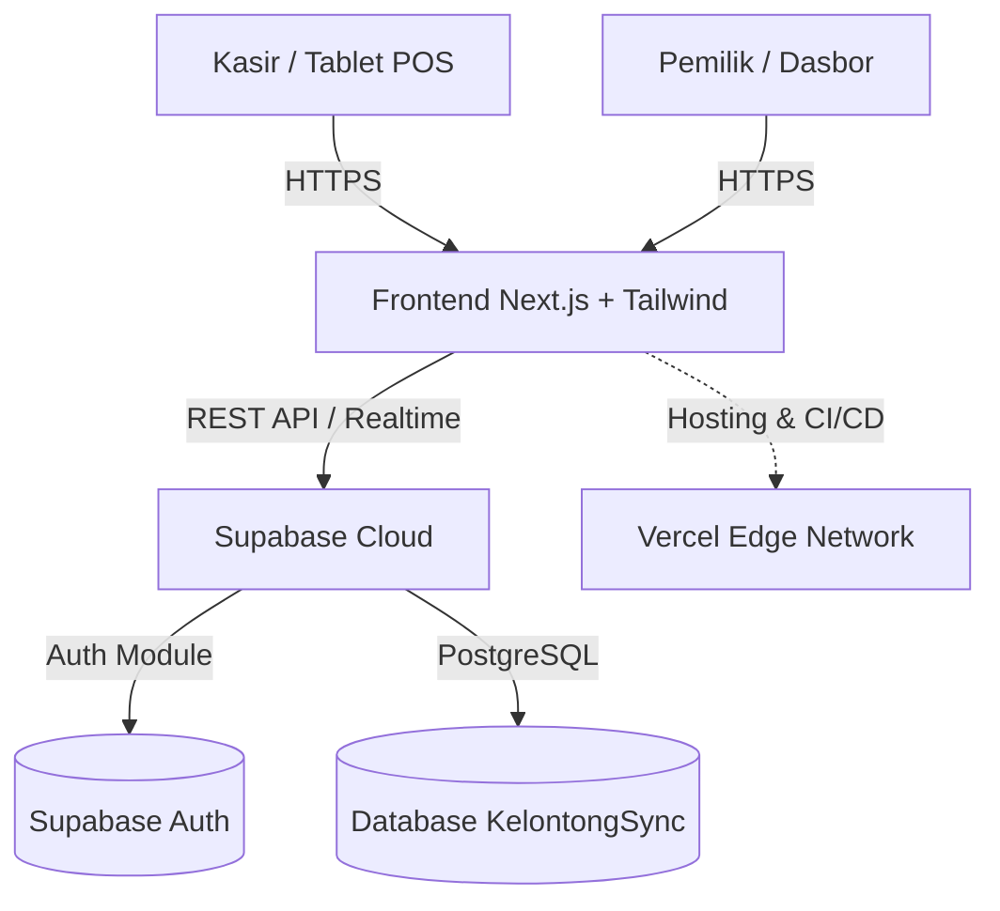
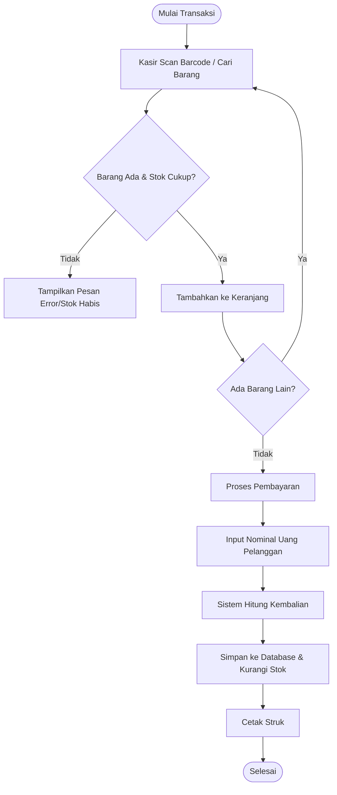

# Rencana Pembangunan Aplikasi KelontongSync

## 1. Pendahuluan
Dokumen ini merupakan perencanaan teknis, arsitektural, dan manajerial untuk proyek pembangunan sistem **KelontongSync** (SaaS Manajemen Toko Kelontong Modern). Proyek ini berfokus pada penyediaan sistem POS (Kasir), inventaris, dasbor analitik, dan kapabilitas multi-cabang untuk UMKM. Proyek ini akan dikerjakan secara kolaboratif oleh tim yang terdiri dari 5 orang.

## 2. Tech Stack yang Digunakan
Sesuai dengan kebutuhan arsitektur cloud SaaS modern yang cepat, ringan, dan handal, berikut adalah tumpukan teknologi (Tech Stack) yang akan digunakan:
- **Frontend**: Next.js (React Framework)
- **Styling**: Tailwind CSS
- **Package Manager**: pnpm
- **Backend & Database**: Supabase (PostgreSQL, Auth)

## 3. Pembagian Modul dan Peran (5 Anggota Tim)

1. **Abdur Rouf (Project Manager & Full Backend Developer)**
   - **Peran**: Pemimpin proyek dan penanggung jawab tunggal seluruh infrastruktur backend.
   - **Tugas**: 
     - Manajemen proyek, sprint planning, dan code review.
     - Penyiapan Supabase (Database Schema, SQL Editor, Auth, Storage).
     - Membuat API Route / Server Actions untuk menjembatani Frontend ke Supabase.
     - Mengelola deployment (Vercel) dan environment variables.

2. **Rafi (Frontend Developer - Modul POS)**
   - **Modul**: Point of Sales (Kasir) & Struk Digital.
   - **Tugas**: Antarmuka kasir, logika keranjang, perhitungan kembalian, dan integrasi cetak struk.

3. **Akmal (Frontend Developer - Modul Inventaris)**
   - **Modul**: Manajemen Stok & Katalog Barang.
   - **Tugas**: CRUD barang, manajemen kategori, dan sistem alert stok menipis.

4. **Adam (Frontend Developer - Modul Dasbor & Laporan)**
   - **Modul**: Dashboard Analitik.
   - **Tugas**: Visualisasi grafik penjualan, margin laba, dan rekapitulasi data harian/mingguan.

5. **Gombet (Frontend Developer - Modul Multi-Cabang & User Management)**
   - **Modul**: Pengelolaan Cabang & Profil.
   - **Tugas**: Antarmuka perpindahan cabang, manajemen akun karyawan, dan pengaturan profil toko.
   - **Tugas**:
     - Menerapkan filter logika Multi-Cabang (memastikan satu kasir hanya melihat data cabang mereka, sedangkan owner bisa melihat semua).
     - Mengonfigurasi otomatisasi deployment di Vercel (CI/CD pipeline).
     - Bertanggung jawab sebagai QA (Software Tester): melakukan UAT (User Acceptance Testing) pada staging sebelum dirilis ke production.

## 4. Fase Pembangunan Aplikasi

- **Fase 1: Inisiasi & Persiapan (Minggu 1)**
  - Setup Repository GitHub dan aturan kolaborasi.
  - Setup proyek Vercel dan Supabase.
  - Implementasi struktur awal database (oleh Gombet).
  - Inisiasi boilerplate Next.js + Tailwind (oleh Adam).

- **Fase 2: Core Development (Minggu 2 - 3)**
  - Pembangunan UI POS dan logika keranjang oleh Rafi.
  - Pembangunan UI Katalog Barang dan Manajemen Inventaris oleh Akmal.
  - Integrasi API otentikasi login oleh Gombet.

- **Fase 3: Integrasi & Fitur Lanjutan (Minggu 4)**
  - Menyambungkan Frontend (POS & Inventaris) ke Supabase Database.
  - Implementasi kalkulasi grafik Dasbor dan sistem Early Warning.
  - Implementasi isolasi data Multi-Cabang.

- **Fase 4: Testing & Deployment Final (Minggu 5)**
  - QA Testing menyeluruh (oleh Adam & Abdur Rouf) meliputi skenario happy flow dan error flow.
  - Bug fixing.
  - Rilis versi produksi 1.0.

## 5. Flowchart dan Diagram Pendukung

### A. Arsitektur Sistem (SaaS Cloud)

*Penjelasan: Klien (baik Kasir maupun Pemilik) mengakses aplikasi melalui browser. Web App yang dihosting di Vercel bertindak sebagai Frontend yang berkomunikasi langsung dengan Supabase untuk keperluan akses data dan otentikasi. Semua terpusat secara real-time.*

### B. Flowchart Transaksi Kasir (Modul POS)

*Penjelasan: Alur kasir berfokus pada kecepatan. Pencarian barang divalidasi langsung ke ketersediaan stok. Setelah pembayaran diinput, sistem menghitung kembalian dan secara atomik menyimpan transaksi sekaligus memotong stok persediaan di inventaris.*

### C. Git Branching Strategy (Git Flow)
```mermaid
gitGraph
    commit id: "Initial Repository"
    branch dev
    checkout dev
    commit id: "Setup Next.js & Supabase"
    branch feature/pos
    checkout feature/pos
    commit id: "UI Keranjang Kasir"
    commit id: "Fungsi Subtotal"
    checkout dev
    merge feature/pos
    branch feature/dashboard
    checkout feature/dashboard
    commit id: "UI Grafik Laba"
    checkout dev
    merge feature/dashboard
    branch staging
    checkout staging
    merge dev id: "Release Candidate (Testing)"
    checkout main
    merge staging id: "V1.0 Production"
```
*Penjelasan:*
- `main`: Branch produksi yang sudah stabil. Terhubung dengan live domain Vercel.
- `staging`: Branch untuk keperluan pengujian menyeluruh (UAT) sebelum dirilis.
- `dev`: Branch integrasi utama tempat semua kode developer digabungkan.
- `feature/*`: Branch sementara yang dibuat oleh setiap developer untuk mengerjakan tiket modul masing-masing. Di-merge ke `dev` via Pull Request.
