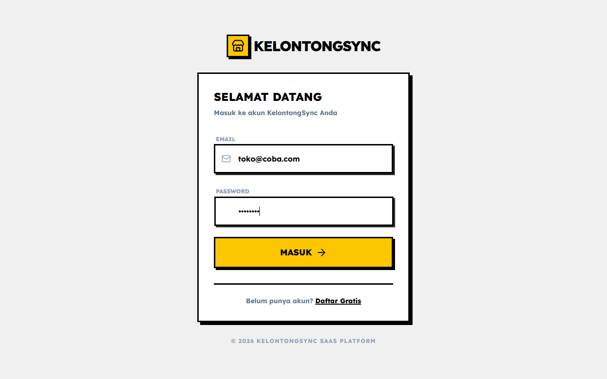
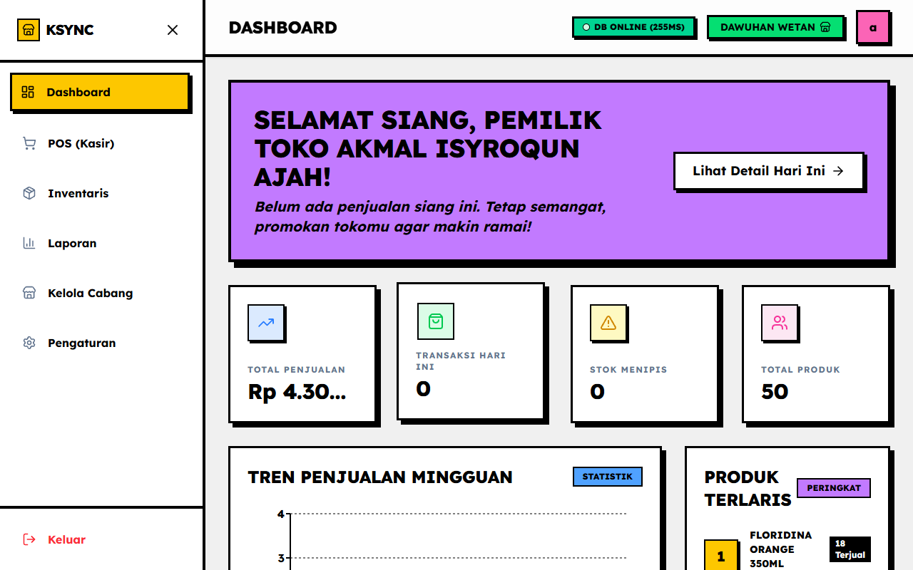
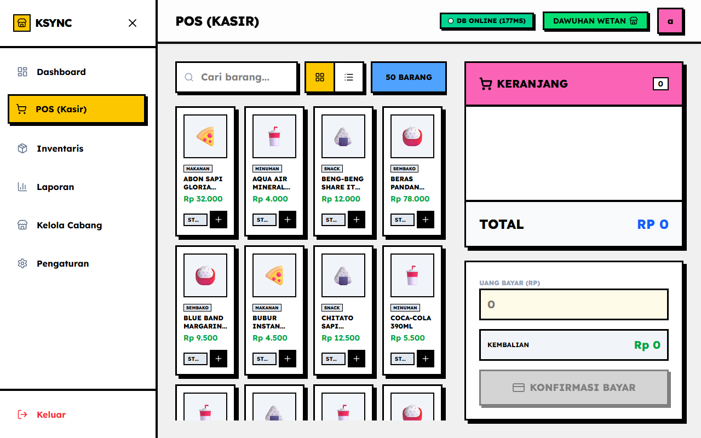
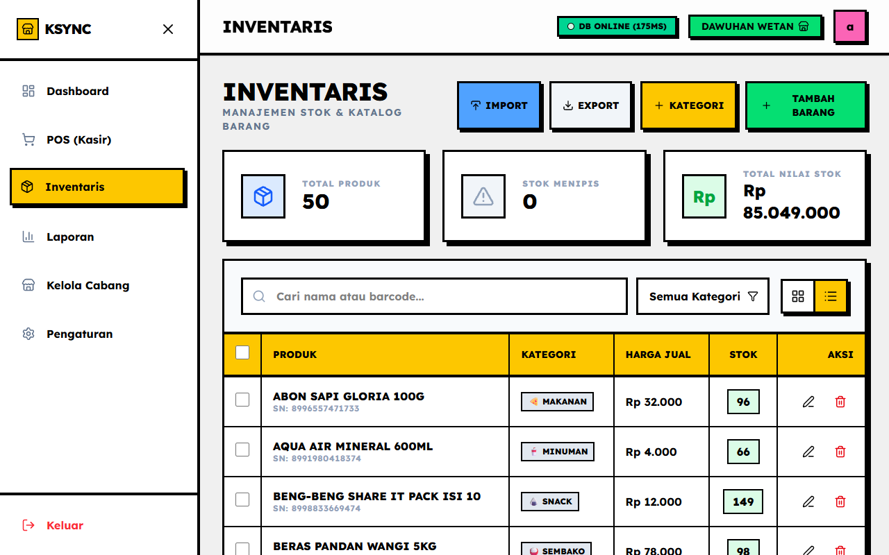
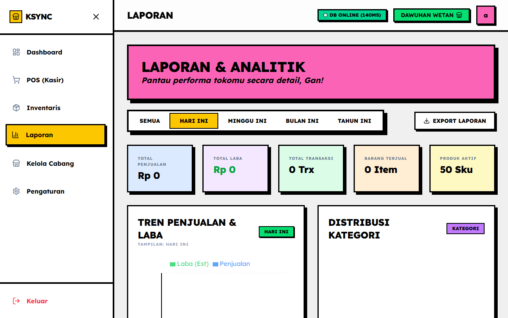
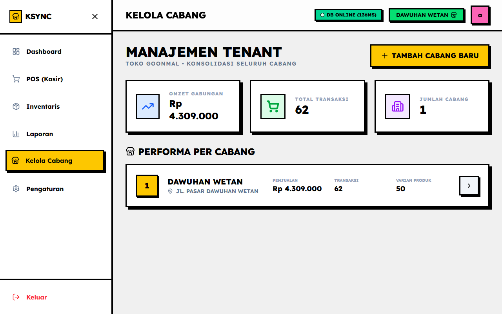
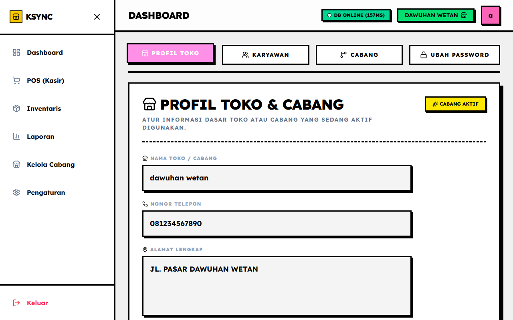

# Panduan Penggunaan KelontongSync

Panduan ini akan menjelaskan langkah demi langkah cara menggunakan aplikasi KelontongSync untuk mengelola toko Anda.

---

## 1. Halaman Login

Halaman pertama yang Anda lihat saat membuka aplikasi. Gunakan email dan kata sandi yang telah didaftarkan untuk masuk ke dalam sistem.

**Cara Penggunaan:**
1. Masukkan alamat email terdaftar pada kolom Email.
2. Masukkan kata sandi pada kolom Password.
3. Klik tombol "Masuk" untuk melanjutkan ke Dashboard.

---

## 2. Dashboard Utama

Dashboard adalah pusat kendali Anda. Di sini Anda dapat melihat ringkasan performa toko secara real-time.

**Informasi yang Ditampilkan:**
1. **Total Omzet:** Menampilkan total pendapatan kotor hari ini.
2. **Total Transaksi:** Menampilkan jumlah struk/transaksi yang terjadi hari ini.
3. **Grafik Penjualan:** Menampilkan tren penjualan selama 7 hari terakhir agar Anda dapat menganalisis performa bisnis.

---

## 3. Kasir (Point of Sales)

Modul ini digunakan oleh kasir untuk melayani pembayaran pelanggan secara langsung.

**Cara Penggunaan:**
1. **Pilih Barang:** Klik produk dari daftar yang tersedia, atau gunakan kotak pencarian untuk mencari nama barang.
2. **Atur Jumlah:** Di bagian "Keranjang" sebelah kanan, Anda bisa mengatur jumlah kuantitas setiap barang yang dibeli (+ atau -).
3. **Proses Pembayaran:** Masukkan jumlah uang tunai yang diberikan pelanggan pada kolom "Nominal Pembayaran".
4. **Selesaikan:** Sistem akan otomatis menghitung uang kembalian. Klik "Bayar" untuk menyelesaikan transaksi dan mencetak struk.

---

## 4. Manajemen Inventaris

Gunakan halaman ini untuk memantau sisa stok barang dan menambahkan produk baru.

**Cara Penggunaan:**
1. **Melihat Stok:** Daftar barang akan menampilkan sisa stok. Sistem akan memberikan peringatan merah jika stok sudah menipis.
2. **Tambah Produk Baru:** Klik tombol "Tambah Produk", lalu isi formulir detail barang (Nama, Harga Beli, Harga Jual, Stok Awal, dan Kategori).
3. **Edit Produk:** Klik ikon pensil pada baris produk untuk mengubah harga atau mengoreksi sisa stok.

---

## 5. Laporan dan Analisis

Halaman laporan membantu Anda melihat pergerakan uang dan stok dalam jangka panjang.

**Cara Penggunaan:**
1. **Filter Tanggal:** Gunakan filter di sudut kanan atas untuk memilih rentang waktu laporan (Harian, Mingguan, atau Bulanan).
2. **Grafik Kategori:** Lihat kategori barang mana yang paling laku melalui diagram pie.
3. **Riwayat Transaksi:** Di bagian bawah, terdapat tabel riwayat semua transaksi. Anda dapat mencetak ulang struk lama atau mengekspor laporan lengkap ke format PDF/Excel.

---

## 6. Manajemen Cabang

Bagi pemilik bisnis dengan lebih dari satu lokasi toko, halaman ini sangat berguna.

**Cara Penggunaan:**
1. **Pindah Cabang:** Anda bisa dengan cepat berpindah tampilan data ke cabang lain melalui tombol pemilih cabang.
2. **Tambah Cabang:** Jika Anda membuka cabang baru, Anda dapat mendaftarkannya di halaman ini tanpa harus membuat akun baru.

---

## 7. Pengaturan Toko

Konfigurasi dasar tentang identitas bisnis Anda.

**Cara Penggunaan:**
1. **Ubah Profil:** Anda dapat mengubah Nama Toko, Alamat, dan Nomor Telepon. Data ini akan otomatis tercetak di bagian atas (header) struk kasir.
2. **Pengaturan Pajak:** Atur persentase pajak PPN (jika ada) yang akan otomatis diakumulasikan dalam transaksi pelanggan.

---
Semua fitur dirancang agar intuitif dan mudah dipelajari dalam waktu kurang dari 10 menit. Selamat menggunakan KelontongSync!
